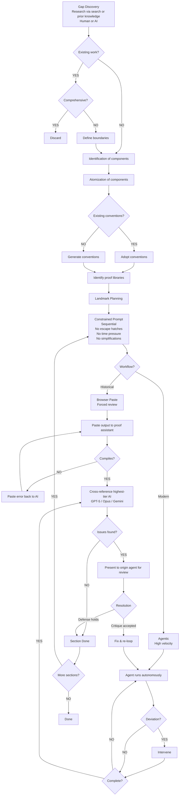

# Agentic Proof Engineering

A methodology for formal verification using AI agents.

## Workflow

```mermaid
flowchart TD
    A[Gap Discovery<br>Research via search or prior knowledge<br>Human or AI] --> B{Existing work?}

    B -->|YES| C{Comprehensive?}
    B -->|NO| D[Identification of components]

    C -->|YES| E[Discard]
    C -->|NO| F[Define boundaries]

    F --> D
    D --> G[Atomization of components]

    G --> H{Existing conventions?}
    H -->|YES| I[Adopt conventions]
    H -->|NO| J[Generate conventions]

    I --> K[Identify proof libraries]
    J --> K

    K --> L[Landmark Planning]

    L --> M[Constrained Prompt<br>Sequential<br>No escape hatches<br>No time pressure<br>No simplifications]

    M --> N{Workflow?}

    N -->|Historical| O[Browser Paste<br>Forced review]
    N -->|Modern| P[Agentic<br>High velocity]

    O --> Q[Paste output to proof assistant]
    Q --> R{Compiles?}
    R -->|NO| S[Paste error back to AI]
    S --> Q
    R -->|YES| T[Cross-reference highest-tier AI<br>GPT-5 / Opus / Gemini]

    P --> U[Agent runs autonomously]
    U --> V{Deviation?}
    V -->|YES| W[Intervene]
    W --> X{Complete?}
    V -->|NO| X
    X -->|NO| U
    X -->|YES| T

    T --> Y{Issues found?}
    Y -->|NO| Z[Section Done]
    Y -->|YES| AA[Present to origin agent for review]

    AA --> AB{Resolution}
    AB -->|Critique accepted| AC[Fix & re-loop]
    AB -->|Defense holds| Z

    AC --> U

    Z --> AD{More sections?}
    AD -->|YES| M
    AD -->|NO| AE[Done]
```
