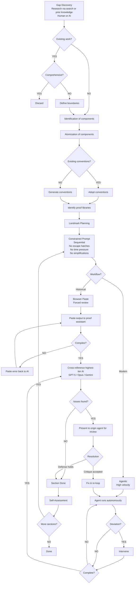

# Agentic Proof Engineering

A methodology for formal verification using AI agents.

## Workflow

## Example: khalil-verified

Repository: [github.com/CharlesCNorton/khalil-verified](https://github.com/CharlesCNorton/khalil-verified)

Formalizing 8th century Arabic prosody by Khalil ibn Ahmad al-Farahidi.

### Workflow Traversal

**Gap Discovery (Research via search or prior knowledge — Human or AI):**
- Researched domain: 8th century Arabic prosody
- Target: Khalil ibn Ahmad al-Farahidi's aruz system (c. 760 CE)
- The original quantitative meter system from which Persian, Turkish, Kurdish, and Urdu prosody descend

**Existing work?** → YES (searched)

**Comprehensive?** → NO

No proof assistant formalization of Arabic prosody exists in Coq, Agda, Lean, or Isabelle.

**Define boundaries:**
- Khalil's original Arabic system
- The 15 canonical meters (16 with later addition)
- The tent-pole terminology (watad, sabab, fāṣila)
- The five circles organization
- Excludes: Persian/Turkish adaptations, Arabic NLP, text processing

**Identification of components:**
- Syllable weight classification
- Building blocks (sabab, watad)
- The eight tafāʿīl (feet)
- The sixteen buḥūr (meters)
- The five dawāʾir (circles)
- Variation rules (zihāf, ʿilla)
- Scansion

**Atomization of components:**
- Layer 1: Syllable weight (Short: CV; Long: CVV or CVC)
- Layer 2: Sabab khafīf, sabab thaqīl, watad majmūʿ, watad mafrūq
- Layer 3: Eight tafāʿīl with weight patterns
- Layer 4: Sixteen buḥūr in five circles
- Layer 5: Zihāf and ʿilla modification rules
- Layer 6: Scansion (deferred)

**Existing conventions?** → NO

No prosody formalization conventions in proof assistants.

**Generate conventions:**
- Inductive types for weight, foot, meter, circle
- Pattern as `list weight`
- Decidable equality for pattern matching
- Finite enumeration for closed sets

**Identify proof libraries:**
- `Stdlib.Lists.List`
- `Stdlib.Logic.FinFun`
- `Stdlib.Structures.Equalities`

**Landmark Planning:**
- Section 1: Foundations
- Section 2: Building Blocks
- Section 3: The Eight Feet
- Section 4: The Sixteen Meters
- Section 5: The Five Circles
- Section 6: Variation Rules
- Section 7: Scansion

**Constrained Prompt (Sequential, No escape hatches, No time pressure, No simplifications):**

Constraints:
- One section at a time
- Single file monolith
- Clean compile before advancing
- Witness, example, and counterexample for each proof
- No admits, no axioms

**Counterexample standard:** A counterexample must test a failure mode or edge case that could plausibly arise from a bug in the definition. Trivial negations (e.g., `X ≠ Y` where X and Y are obviously different) do not qualify.

**Workflow mode:** Modern (Agentic, High velocity)

### Progress

| Section | Status |
|---------|--------|
| 1. Foundations | Complete |
| 2. Building Blocks | In progress |
| 3. The Eight Feet | Pending |
| 4. The Sixteen Meters | Pending |
| 5. The Five Circles | Pending |
| 6. Variation Rules | Pending |
| 7. Scansion | Pending |
